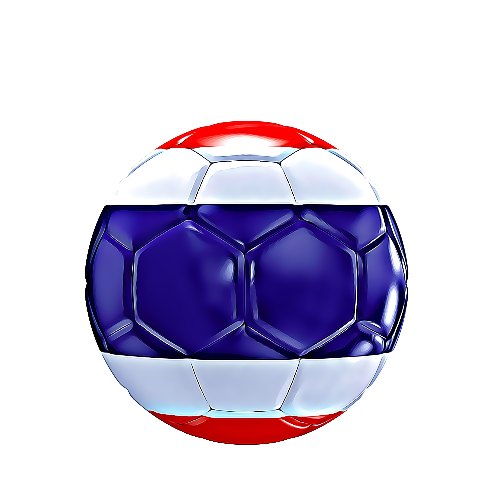
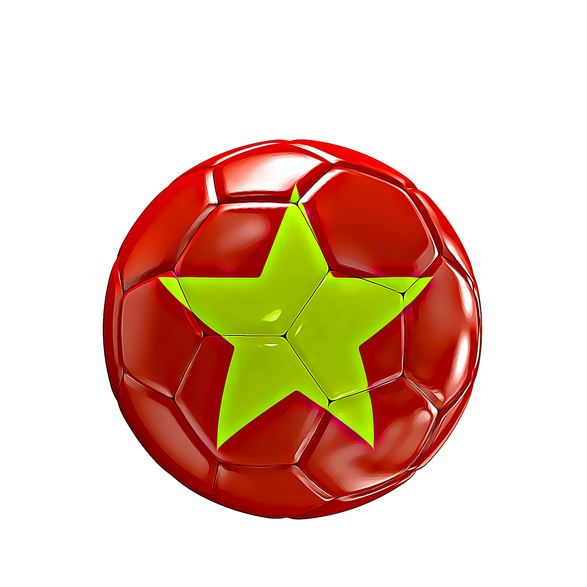
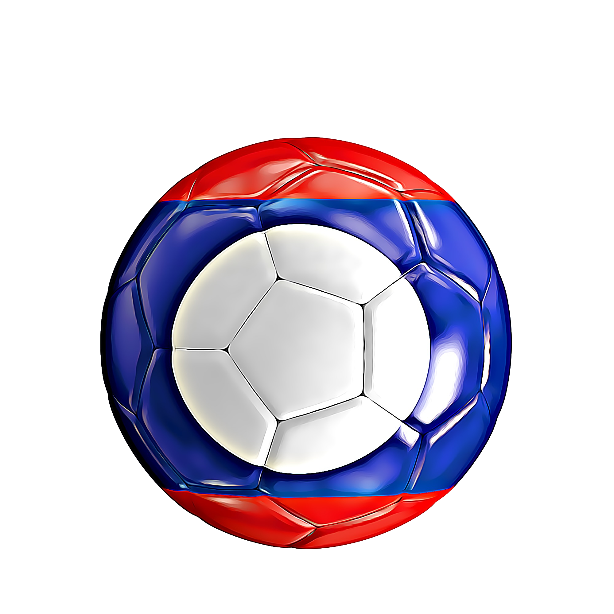
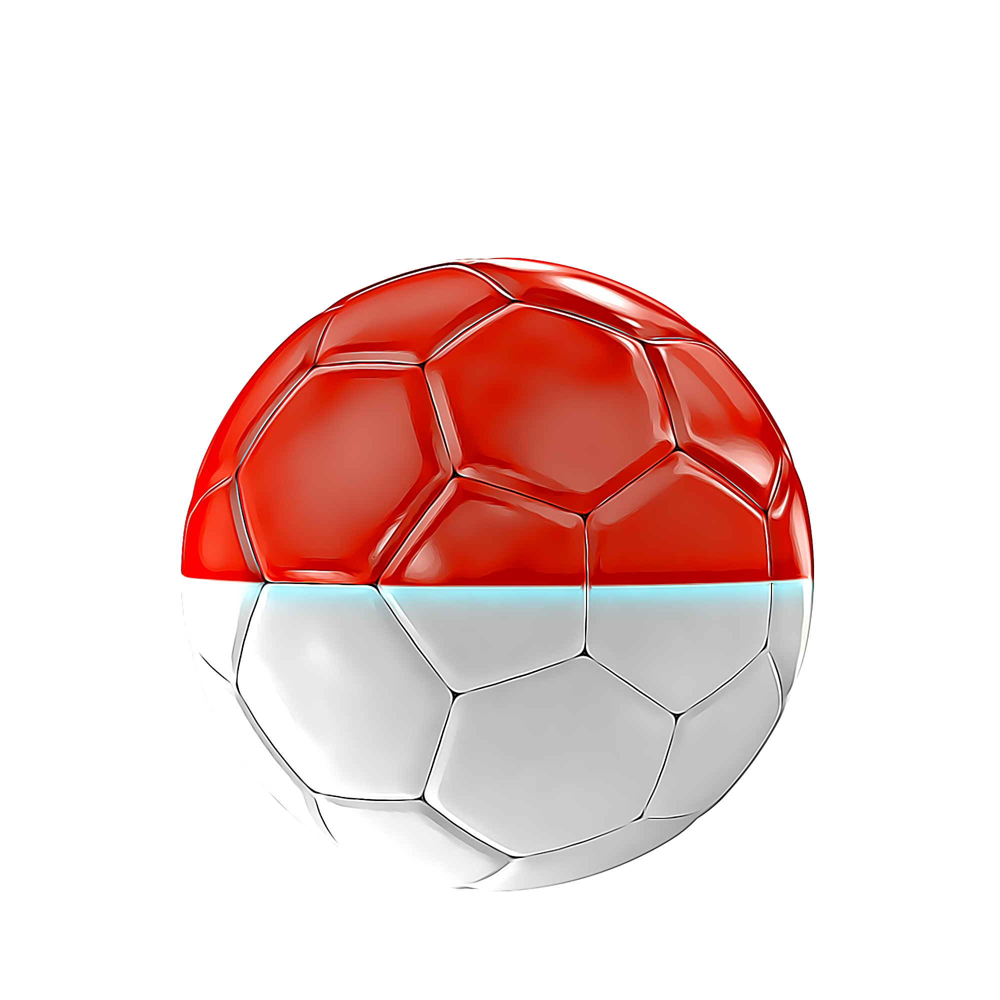
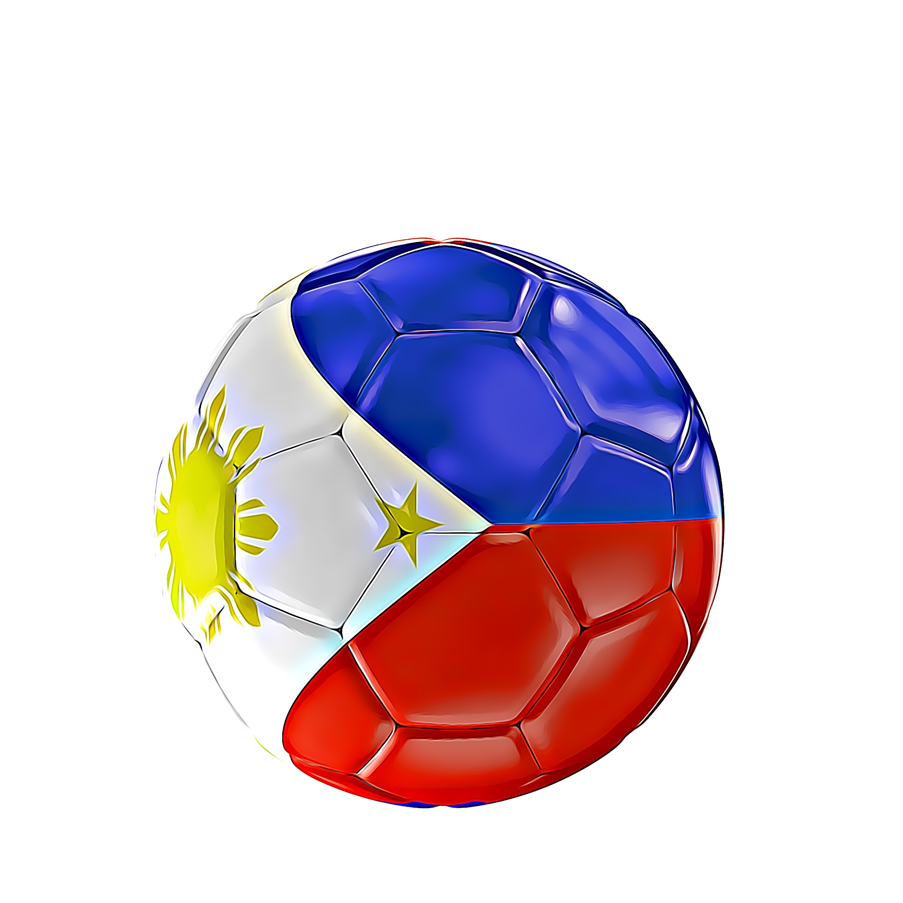
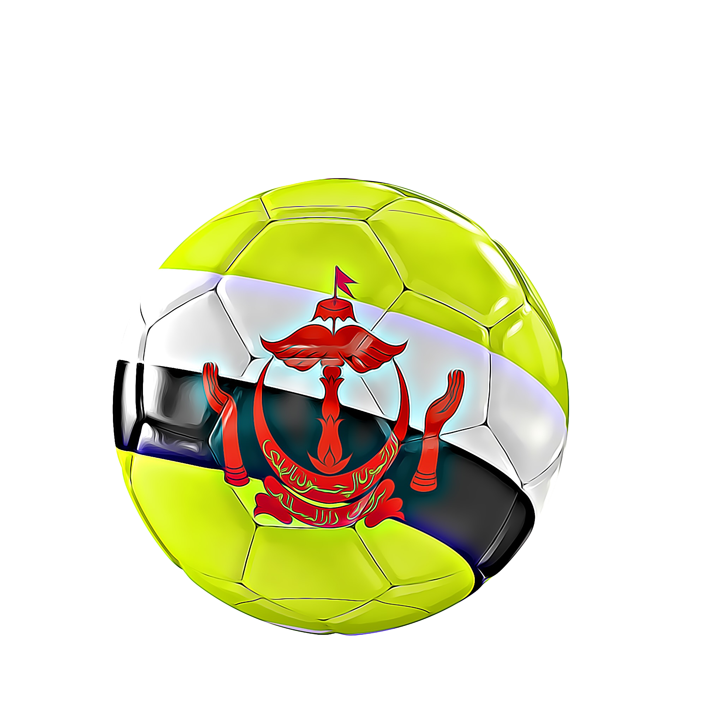
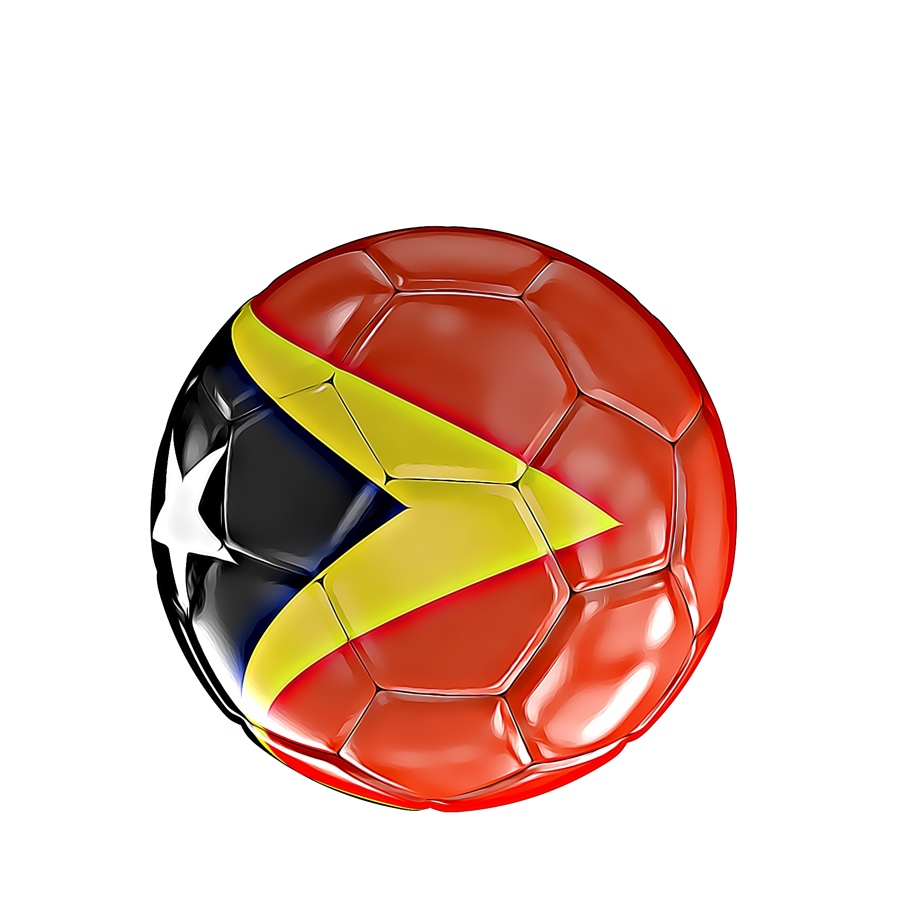
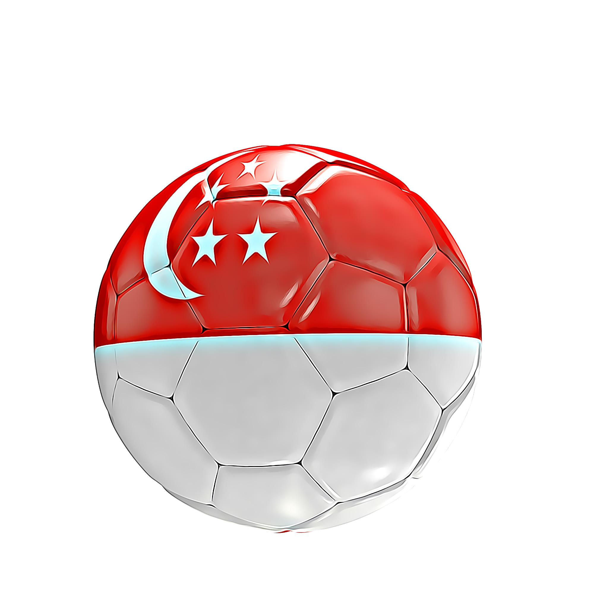
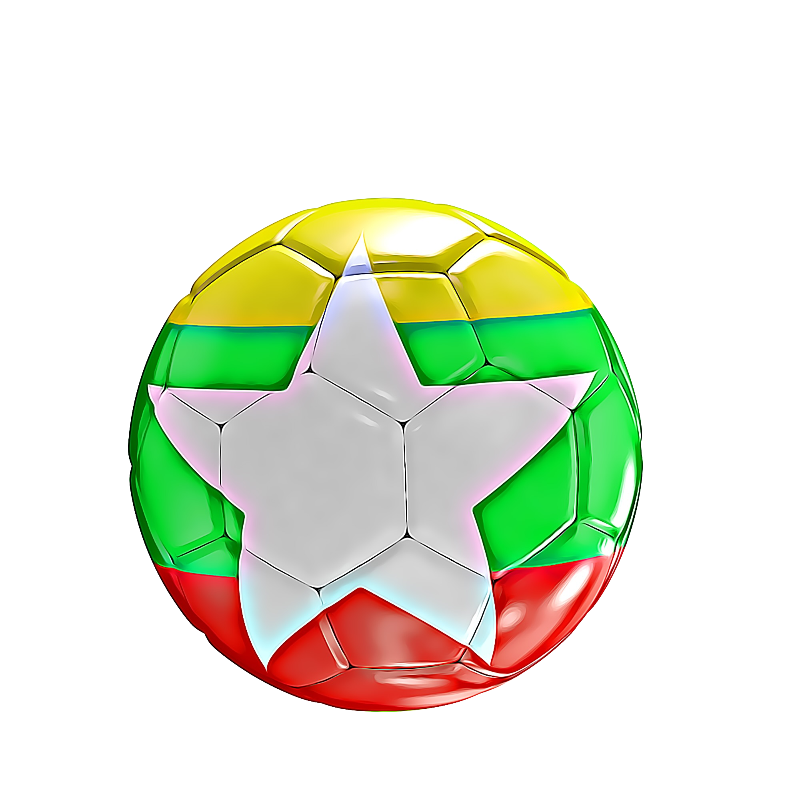

# 🇭🇷 Rare boxes and custom balls

In the purchase of rare boxes, in addition to the pieces that will be used to increase the levels of the T-shirt, you can receive personalized balls from different countries, where you will also have the right to choose your favorite country, being able of course to sell or keep in your NFT collection. , with the exception that if you prefer to increase your collection, you have the possibility of acquiring the NFT's balls

.png>)          .png>) .png>)                 .png>) .png>) .png>)        
